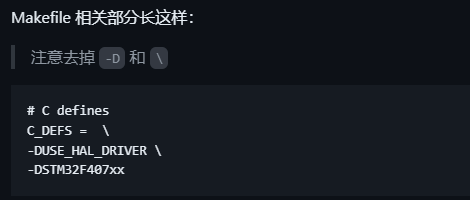

# EIDE环境配置
## 1.先创建cube工程并保存（makefile）
## 2.new project----empty project----选择芯片----填入和cube工程名称一样的名字----弹出的文件夹选择工程目录的上一级文件夹
效果：
## 3.配置EIDE工程
### 3.1 打开eide插件栏，添加.s文件和源文件夹（重要）
#### project resources右键--add file

#### 然后选择名称类似 startup_stm32xxxxx.s 的 .s 文件（不同芯片文件不同）
#### 添加 .c 文件夹
#### 项目资源 - 右键 - 添加源文件夹，选择普通文件夹
#### 添加 Core, Drivers 等所有包含 .c 文件的文件夹

### 3.2配置GCC
- **填写芯片型号**
- **链接脚本路径：填写工程目录下 STM32xxxx_FLASH.ld 文件的相对路径（不同芯片文件不同）**
- **对于有 FPU 的 CPU：**
  - **在硬件浮点选项中选 single （对于 Cortex-M4）**
  - **在构建器选项 - 全局选项 - 硬件浮点 ABI 选 hard（记得保存）**
**在 Makefile 里可以找到这些：**
### cpu
CPU = -mcpu=cortex-m4
### fpu
FPU = -mfpu=fpv4-sp-d16
### float-abi
FLOAT-ABI = -mfloat-abi=hard

### 3.3 选择烧录器类型和芯片具体型号
### 3.4 配置 project attributes
**包含目录**
如果设置中勾选了 EIDE.Source Tree: Auto Search Include Path（如下图），那么 EIDE 会自动搜索项目资源中添加的文件夹，这里就不用手动填入了

**否则参考Makefile填入对应文件夹**

**配置Preprocessor Definitions**

**在预处理器定义栏点击加号**
